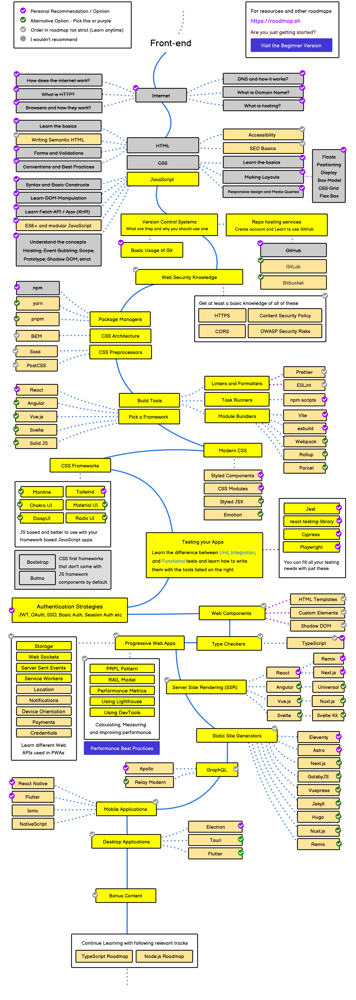

# Gulog

Gulog

## 前端学习路径

Reference: https://roadmap.sh/frontend

---

Guitenbay 的前端学习笔记

内容包括：

- [Internet](https://gulog.github.io/internet "学习 Internet")
- [HTML](https://gulog.github.io/html "学习 HTML")
- [CSS](https://gulog.github.io/css "学习 CSS")
- [JS](https://gulog.github.io/javascript "学习 JavaScript")
- [React](https://gulog.github.io/react "学习 React")
- [D3.js](https://gulog.github.io/d3 "学习 D3")
- [Node.js](https://gulog.github.io/node "学习 Node.js")
- [Webpack](https://gulog.github.io/webpack "学习 Webpack")
- [Vue](https://gulog.github.io/vue "学习 Vue")
